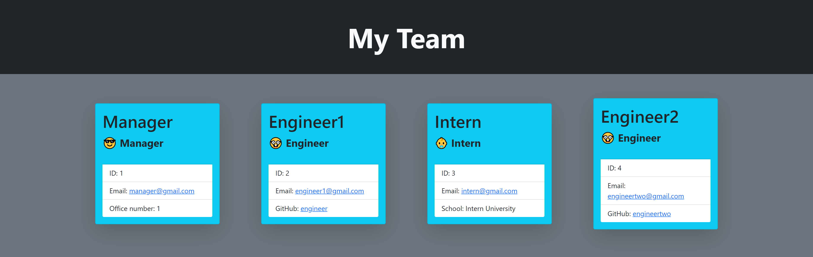

# Object-Oriented Programming: Team Profile Generator

## Purpose

The purpose of this project was to create an interactive team profile generator. This application takes user inputs for the team member information and generates an html file.  

Some features of the site are:
- This application allows the user to create a team of any size consisting of one manager and any number of engineers/interns. 
- The cards that are generated by the application contain urls that can be used to send an email to the team member or visit their github profile if they are an engineer. 
- The application contains validation of user inputs to ensure correct data is entered. 

---

## Utilization

This application is intended to be used with a team consisting of one manager and any number of engineers/interns.

The input validation for user input consists of:
- Name: Must begin with a capital letter
- Email: Must follow standard email format
- Office number: Must be a numeral
- Github username: Must follow github username convention
- University: Must begin with a capital letter

A guide to utilizing the application can be found at: https://www.youtube.com/watch?v=NUfz7ppw4cE

---

## Testing

This application consists of testing files for each of the classes. If you wish to add a class of employee please follow the testing convention of the existing classes. 
- Test for the creation of the class object. 
- Test for any methods created for new classes or added to existing. 

---
## Appearance

This application utilized BootStrap 5 for its styling. 

### Here is an example of the application with some team members added:  

